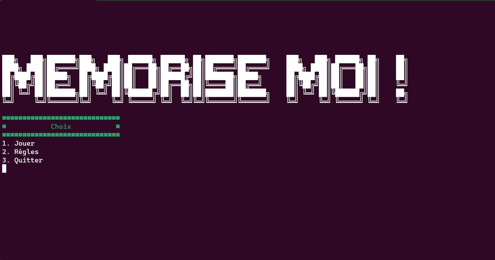

# Memorise Moi !
===========

Développé par Mathys Bollengier et Adrien Fryson
Contacts : mathys.bollengier.etu@univ-lille.fr, adrien.fryson.etu@univ-lille.fr

# Présentation de <le nom de votre jeu>

<Description de votre jeu>



# Utilisation de <le nom de votre jeu>

Afin d'utiliser le projet, il suffit de taper les commandes suivantes dans un terminal :

```
./compile.sh
```
Permet la compilation des fichiers présents dans 'src' et création des fichiers '.class' dans 'classes'

```
./run.sh
```
Permet le lancement du jeu
